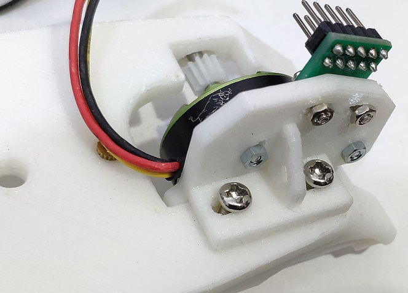

# 使い方 How to use
## VSシャシーの改造
　ミニ四駆のシャシは数種類ありますが，「VSシャシ」を使います．  
 　普通にミニ四駆を組み立てた後，「ギヤボックス・カバー」の一部を削ります（この穴を使って，ギヤを駆動する）．  
 
* ギヤボックス・カバー上部を削ります
* ギヤボックス・カバーのモータを覆う部分も削ります

## モータ＆インバータ
　このキットを使います．  
https://shop.cqpub.co.jp/hanbai/books/I/I000346.html  
　ミニ四駆に標準で付いている130モータの代わりに，上記キットに付属するドローン用のブラシレスモータを取り付け，それを駆動するインバータボード（とマイコンボード）を車両に積み上げます．

## DCブラシレスモーターにピニオンギヤを付ける
DCブラシレスモータの軸に取り付ける，適当なサイズのピニオンギヤが必要です（ミニ4駆のギヤはモジュール0.5程度）．
 
このピニオンギヤを使いました（おすすめは12T）．千石電商さんで買えます．ギヤのモジュールとギヤの内径が合えばなんでもOKです．

 
　上記のピニオンギヤはモータの軸に対して少し穴が小さいです．  
 従って，穴をφ3mmに広げるためにドリルを通します．
 
　穴あけは，当初φ2.8mmのドリルでやってみましたが，狭すぎてモーター軸に挿せませんでした．φ3mmのドリルを通した場合でも，ピニオンギヤはしっかり固定されるのでOKと思います．
 
　ダイソーのドリルセット黄色を使いました．
 
## ギヤを変える change normal gears
　VSシャシ―標準のギヤは減速比が小さいので，減速比の大きなもの（5:1）に変えます．G-6＆G-10を使うとよいです．  
 
 

## 必要な部材 Material
　DCブラシレスモータをモータベース（3Dプリント）に取り付けるためにビスが必要です．
* ビス2㎜×10㎜ 
タミヤでちょうどよいものを売っています

* M3インサートナット（普通のナットでも代用できるかも）
* 3セルのLipoバッテリー
* ピニオンギヤ

## 必要な工具
* ドリル
ダイソーでよいものを売っています
* はんだこて
* ニッパー
* ペンチ
* ドライバ

# STLデータ（3D） About STL Data
　モータベースなど，独自の筐体（白い部品）は，3Dプリントで作ります．そのためのSTLデータはこのリポジトリで公開しています（ウェブ・ブラウザ上で形状を見れるはず）．
　GitHubではファイルサイズの大きなデータを公開できないため，詳細な3Dモデル（STL）を公開できません．少し粗いデータを公開していますが，印刷するには十分と思います．
 　3Dプリンタを持っていない場合は，JLCPCBやDMM.comで印刷してもらうとよいでしょう．どの程度，収縮するかは印刷してみないと分かりません．印刷した後，必要ならヤスリで調整するなどしてください．
 
## ボデー Body
　File Name: VS-body-git.stl
  
　VSシャシーに乗せて使えるようにしてあります．シャシへは，標準のボディ止めパーツ（排気管を模したやつ）で固定できます．
  
　製作には，バリアトロン（JAN4950344954094）を使ったので大き目のタイヤに最適化してあります．と言っても見た目を調整した程度の話です．VSシャシであれば他の機種でも使えます．
 
　取付は無改造でできますが，モーターと接続するためには，VSシャシ―の改造　の所に書いてあるように，ギヤボックス・カバーに改造が必要です．
 
## モーターベース Motor Base Part
 File Name: VS-motormount.stl
 
　DCブラシレスモータBL2804-1700Kv-1とホールセンサ基板を取り付けます．ボデーとの取付はM3ビスで行います．この時，シャシー前後方向に位置調整できるようにボルトを通す穴（バカ穴）が長穴になっています．
 

 
 
ベースとモーターの取り付けはM2ビスで行います．ほぼ上下方向の長バカ穴になっているので上下方向に調整できます．ギヤの噛み合いを見て調整します．
 
　モーター，モーターベース，ボデーの組立は知恵の輪となっています．まぁ頑張って下さい．

 ## 電源
 　モータを回すには電源が必要です．  
  写真のインバータボード（青）を使うなら，3セルのリポあたりが丁度よさそうです．
  
  
  
 
  
