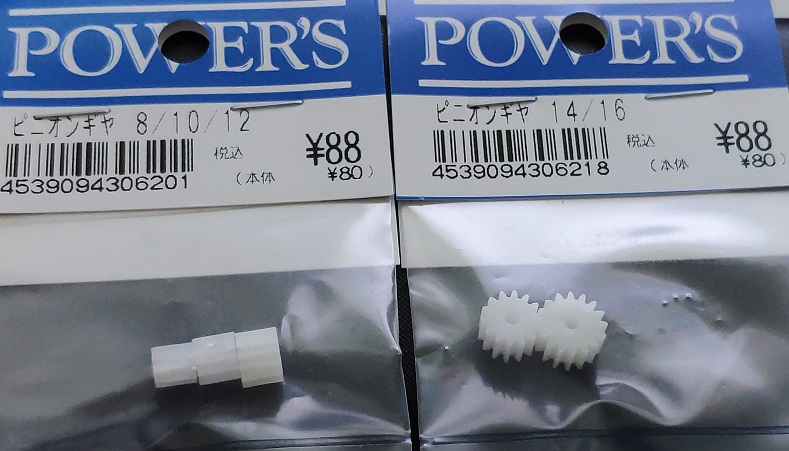

# 使い方 How to use
## VSシャシーの改造
　パーツ「ギヤボックス・カバー」の一部を削ります．
 
* 上部を削ります
* ノーマルのモータを覆う部分を削ります

## DCブラシレスモーターにピニオンギヤを付ける
適当なサイズのピニオンギヤが必要です（ミニ4駆のギヤはモジュール0.5程度）．
 
このピニオンギヤを使いました（おすすめは12T）．千石電商さんで買えます．

 
　ピニオンギヤの穴をφ3mmに広げるためにドリルを通します．
 
　当初φ2.8mmでやってみましたが，狭すぎてモーター軸に挿せませんでした．φ3mmでもしっかり固定さえるのでOKと思います．
 
　ダイソーのドリルセット黄色を使いました．
 
## ギヤを変える change normal gears
　VSシャシ―標準のギヤは減速比が小さいので，減速比の大きなもの（5:1）に変えます．G-6＆G-10を使うとよいです．
 

## 必要な部材 Material
* ビス2㎜×10㎜ 
タミヤでちょうどよいものを売っています

* M3インサートナット（普通のナットでも代用できるかも）
* 3セルのLipoバッテリー
* ピニオンギヤ

## 必要な工具
* ドリル
ダイソーでよいものを売っています
* はんだこて
* ニッパー
* ペンチ
* ドライバ

# STLデータ（3D） About STL Data
　GitHubでは大きなデータを公開できないため，詳細な3Dモデル（STL）を公開できません．少し粗いデータを公開していますが，印刷するには十分と思います．
 
## ボデー Body
　File Name: VS-body-git.stl
  
　VSシャシーに乗せて使えるようにしてあります．標準のボディ止めパーツ（排気管を模したやつ）で固定できます．
  
　製作には，バリアトロン（JAN4950344954094）を使ったので大き目のタイヤに最適化してあります．ただし見た目程度の話です．VSシャシであれば他の機種でも使えます．
 
　取付は無改造でできますが，モーターと接続するためには，VSシャシ―の改造　の所に書いてあるように，ギヤボックス・カバーに改造が必要です．
 
## モーターベース Motor Base Part
 File Name: VS-motormount.stl
 
　BL2804-1700Kv-1とホールセンサ基板を取り付けます．ボデーとの取付はM3ビスで行います．この時，シャシー前後方向に位置調整できるようにバカ穴が長穴になっています．
 
ベースとモーターの取り付けはM2ビスで行います．ほぼ上下方向の長バカ穴になっているので上下方向に調整できます．ギヤの噛み合いを見て調整します．
 
　モーター，モーターベース，ボデーの組立は知恵の輪となっています．まぁ頑張って下さい．
 
 
  
